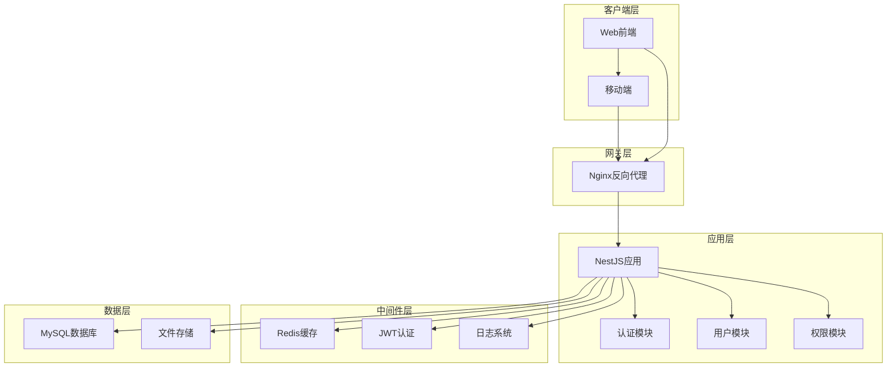
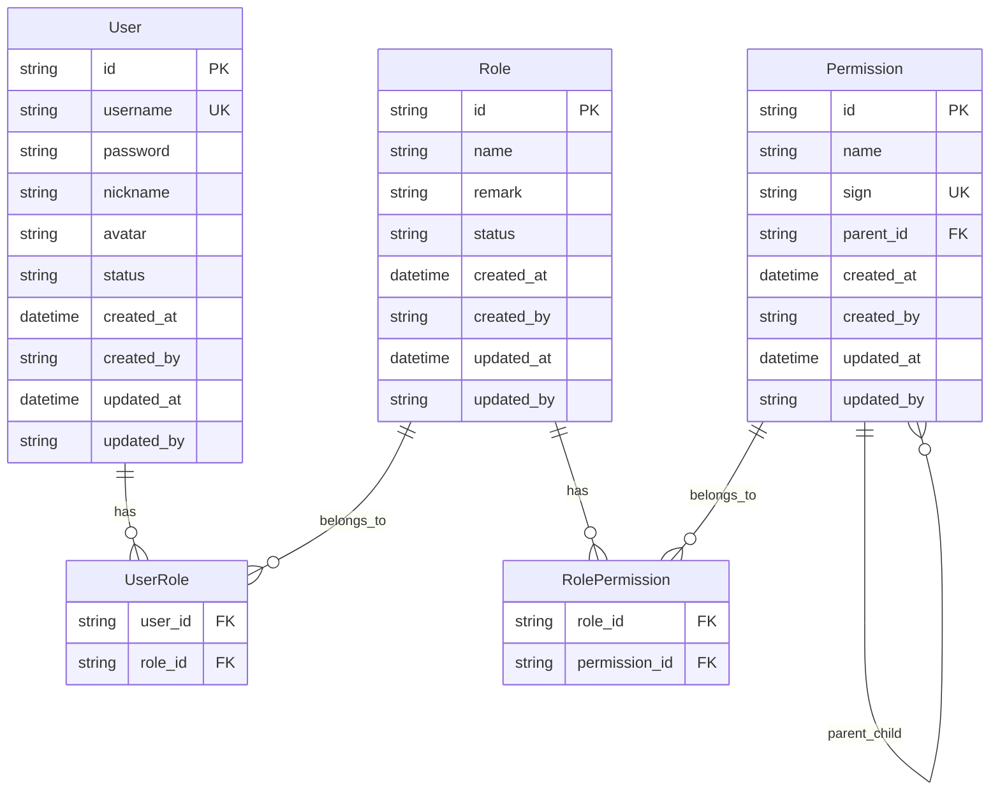
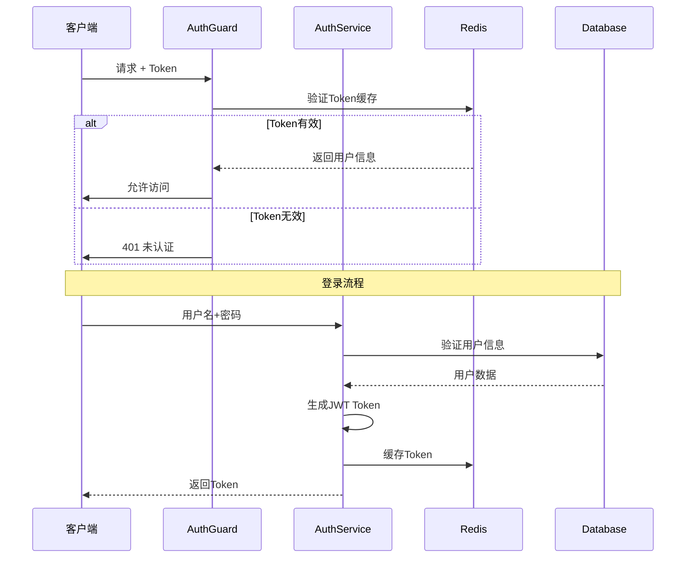
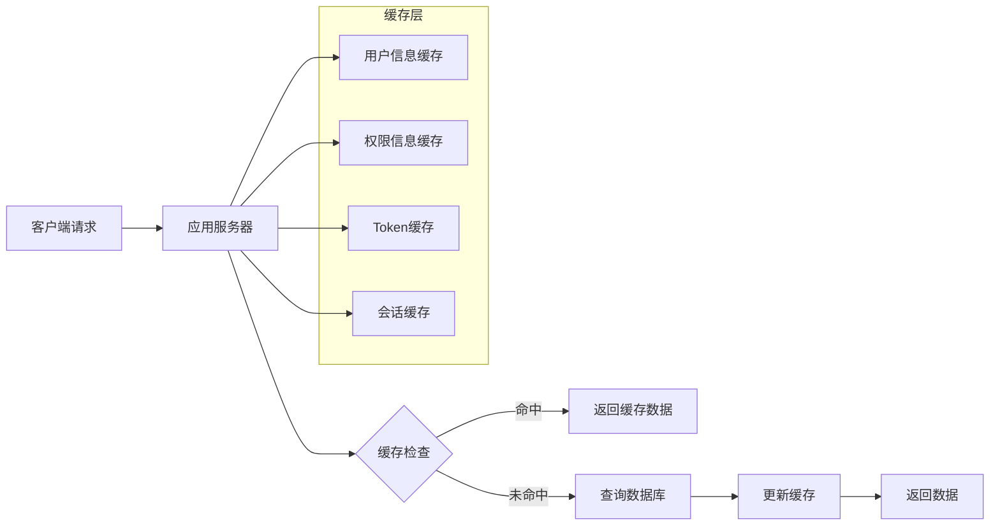
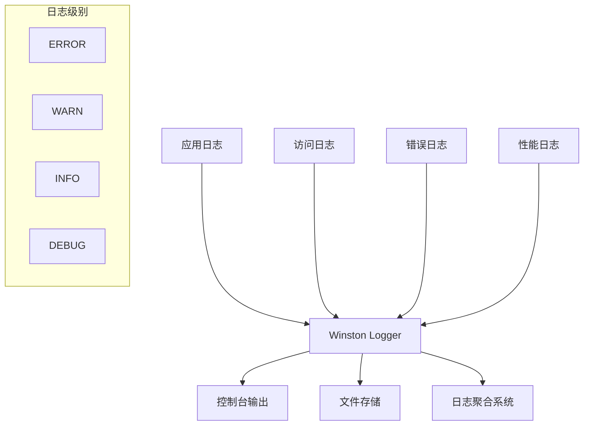
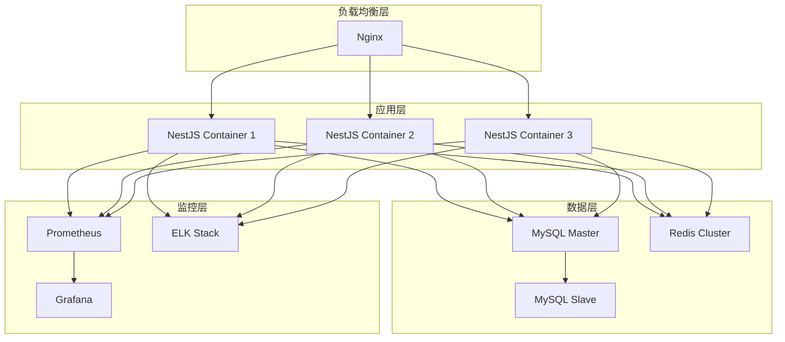
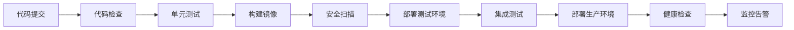

# Nest 后端项目技术设计文档

## 系统架构设计

### 整体架构图



### 技术架构分层

#### 1. 表现层 (Presentation Layer)
- **控制器 (Controllers)**：处理HTTP请求和响应
- **守卫 (Guards)**：认证和授权检查
- **拦截器 (Interceptors)**：请求/响应数据转换
- **过滤器 (Filters)**：异常处理

#### 2. 业务逻辑层 (Business Logic Layer)
- **服务 (Services)**：核心业务逻辑实现
- **数据传输对象 (DTOs)**：数据验证和转换
- **装饰器 (Decorators)**：横切关注点

#### 3. 数据访问层 (Data Access Layer)
- **实体 (Entities)**：数据模型定义
- **仓储 (Repositories)**：数据访问抽象
- **数据库连接**：TypeORM配置

#### 4. 基础设施层 (Infrastructure Layer)
- **配置管理**：环境配置和参数管理
- **缓存服务**：Redis缓存实现
- **日志服务**：Winston日志记录
- **邮件服务**：SMTP邮件发送

## 数据库设计

### 数据库架构图



### 数据库表设计

#### 1. 用户表 (user)
```sql
CREATE TABLE `user` (
  `id` varchar(36) NOT NULL COMMENT '主键ID',
  `username` varchar(50) NOT NULL COMMENT '用户名',
  `password` varchar(255) NOT NULL COMMENT '密码',
  `nickname` varchar(50) NOT NULL COMMENT '昵称',
  `avatar` varchar(255) DEFAULT NULL COMMENT '头像URL',
  `status` char(1) DEFAULT '1' COMMENT '状态：0-禁用，1-启用',
  `created_at` timestamp NOT NULL DEFAULT CURRENT_TIMESTAMP COMMENT '创建时间',
  `created_by` varchar(50) DEFAULT 'system' COMMENT '创建人',
  `updated_at` timestamp NOT NULL DEFAULT CURRENT_TIMESTAMP ON UPDATE CURRENT_TIMESTAMP COMMENT '更新时间',
  `updated_by` varchar(50) DEFAULT NULL COMMENT '更新人',
  PRIMARY KEY (`id`),
  UNIQUE KEY `uk_username` (`username`),
  KEY `idx_status` (`status`),
  KEY `idx_created_at` (`created_at`)
) ENGINE=InnoDB DEFAULT CHARSET=utf8mb4 COMMENT='用户表';
```

#### 2. 角色表 (role)
```sql
CREATE TABLE `role` (
  `id` varchar(36) NOT NULL COMMENT '主键ID',
  `name` varchar(50) NOT NULL COMMENT '角色名称',
  `remark` varchar(255) DEFAULT NULL COMMENT '角色描述',
  `status` char(1) DEFAULT '1' COMMENT '状态：0-禁用，1-启用',
  `created_at` timestamp NOT NULL DEFAULT CURRENT_TIMESTAMP COMMENT '创建时间',
  `created_by` varchar(50) DEFAULT 'system' COMMENT '创建人',
  `updated_at` timestamp NOT NULL DEFAULT CURRENT_TIMESTAMP ON UPDATE CURRENT_TIMESTAMP COMMENT '更新时间',
  `updated_by` varchar(50) DEFAULT NULL COMMENT '更新人',
  PRIMARY KEY (`id`),
  UNIQUE KEY `uk_name` (`name`),
  KEY `idx_status` (`status`)
) ENGINE=InnoDB DEFAULT CHARSET=utf8mb4 COMMENT='角色表';
```

#### 3. 权限表 (permission)
```sql
CREATE TABLE `permission` (
  `id` varchar(36) NOT NULL COMMENT '主键ID',
  `name` varchar(50) NOT NULL COMMENT '权限名称',
  `sign` varchar(100) NOT NULL COMMENT '权限标识',
  `parent_id` varchar(36) DEFAULT NULL COMMENT '父权限ID',
  `created_at` timestamp NOT NULL DEFAULT CURRENT_TIMESTAMP COMMENT '创建时间',
  `created_by` varchar(50) DEFAULT 'system' COMMENT '创建人',
  `updated_at` timestamp NOT NULL DEFAULT CURRENT_TIMESTAMP ON UPDATE CURRENT_TIMESTAMP COMMENT '更新时间',
  `updated_by` varchar(50) DEFAULT NULL COMMENT '更新人',
  PRIMARY KEY (`id`),
  UNIQUE KEY `uk_sign` (`sign`),
  KEY `idx_parent_id` (`parent_id`),
  CONSTRAINT `fk_permission_parent` FOREIGN KEY (`parent_id`) REFERENCES `permission` (`id`)
) ENGINE=InnoDB DEFAULT CHARSET=utf8mb4 COMMENT='权限表';
```

### 索引设计策略

#### 1. 主键索引
- 所有表使用UUID作为主键
- 确保全局唯一性和分布式友好

#### 2. 唯一索引
- `user.username`：用户名唯一性约束
- `role.name`：角色名唯一性约束
- `permission.sign`：权限标识唯一性约束

#### 3. 普通索引
- `user.status`：用户状态查询优化
- `user.created_at`：时间范围查询优化
- `permission.parent_id`：权限树查询优化

#### 4. 复合索引
- `user_role(user_id, role_id)`：用户角色关联查询
- `role_permission(role_id, permission_id)`：角色权限关联查询

## API 设计

### RESTful API 设计原则

#### 1. URL 设计规范
```
# 资源命名使用复数形式
GET    /nest/users          # 获取用户列表
POST   /nest/users          # 创建用户
GET    /nest/users/{id}     # 获取指定用户
PUT    /nest/users/{id}     # 更新指定用户
DELETE /nest/users/{id}     # 删除指定用户

# 嵌套资源
GET    /nest/users/{id}/roles     # 获取用户的角色列表
POST   /nest/users/{id}/roles     # 为用户分配角色
```

#### 2. HTTP 状态码使用
```
200 OK          # 请求成功
201 Created     # 资源创建成功
400 Bad Request # 请求参数错误
401 Unauthorized # 未认证
403 Forbidden   # 无权限
404 Not Found   # 资源不存在
500 Internal Server Error # 服务器内部错误
```

### API 响应格式设计

#### 1. 统一响应格式
```typescript
interface ApiResponse<T> {
  code: number;        // 业务状态码
  data: T;            // 响应数据
  msg: string;        // 响应消息
  timestamp?: string; // 时间戳
}

// 成功响应示例
{
  "code": 200,
  "data": {
    "id": "uuid-string",
    "username": "john_doe",
    "nickname": "John"
  },
  "msg": "成功"
}

// 错误响应示例
{
  "code": 400,
  "data": null,
  "msg": "用户名已存在",
  "timestamp": "2024-01-01T00:00:00.000Z"
}
```

#### 2. 分页响应格式
```typescript
interface PaginatedResponse<T> {
  list: T[];          // 数据列表
  total: number;      // 总记录数
  page: number;       // 当前页码
  pageSize: number;   // 每页大小
  totalPages: number; // 总页数
}
```

### API 文档设计

#### 1. Swagger 配置
```typescript
const options = new DocumentBuilder()
  .setTitle('Nest API')
  .setDescription('Nest 后端管理系统 API 文档')
  .setVersion('1.0')
  .addBearerAuth()
  .addTag('auth', '认证相关接口')
  .addTag('users', '用户管理接口')
  .addTag('roles', '角色管理接口')
  .addTag('permissions', '权限管理接口')
  .build();
```

#### 2. API 端点文档
```typescript
@ApiOperation({ 
  summary: '用户登录',
  description: '用户通过用户名和密码进行登录认证，成功后返回JWT token'
})
@ApiBody({
  description: '登录请求参数',
  type: LoginDto,
  examples: {
    example1: {
      summary: '登录示例',
      value: {
        username: 'admin',
        password: 'encrypted_password'
      }
    }
  }
})
@ApiResponse({
  status: 201,
  description: '登录成功',
  schema: {
    example: {
      code: 200,
      data: {
        access_token: 'eyJhbGciOiJIUzI1NiIsInR5cCI6IkpXVCJ9...'
      },
      msg: '登录成功'
    }
  }
})
```

## 安全架构设计

### 认证授权架构图



### 安全机制设计

#### 1. 认证机制
- **JWT Token**：无状态认证，包含用户基本信息
- **Token 缓存**：Redis存储有效token，支持快速验证和主动失效
- **密码加密**：AES对称加密，前后端统一密钥
- **Token 刷新**：支持token自动续期机制

#### 2. 授权机制
- **RBAC 模型**：基于角色的访问控制
- **权限标识**：细粒度权限控制，支持功能级权限
- **权限继承**：支持权限的层级结构
- **动态权限**：运行时权限检查和更新

#### 3. 安全防护
```typescript
// 输入验证
@IsString()
@IsNotEmpty()
@Length(3, 20)
@Matches(/^[a-zA-Z0-9_]+$/)
username: string;

// SQL注入防护
@Query('SELECT * FROM user WHERE id = ?', [userId])

// XSS防护
@Transform(({ value }) => sanitizeHtml(value))
content: string;

// CSRF防护
app.use(csrf());
```

## 性能优化设计

### 缓存架构设计



### 性能优化策略

#### 1. 数据库优化
```sql
-- 查询优化
EXPLAIN SELECT u.*, r.name as role_name 
FROM user u 
LEFT JOIN user_role ur ON u.id = ur.user_id 
LEFT JOIN role r ON ur.role_id = r.id 
WHERE u.status = '1' 
ORDER BY u.created_at DESC 
LIMIT 20;

-- 索引优化
CREATE INDEX idx_user_status_created ON user(status, created_at);
CREATE INDEX idx_user_role_composite ON user_role(user_id, role_id);
```

#### 2. 缓存策略
```typescript
// 用户权限缓存
@Cacheable('user:permissions', 1800) // 30分钟
async getUserPermissions(userId: string): Promise<Permission[]> {
  return await this.findUserPermissions(userId);
}

// 缓存失效策略
async updateUserRole(userId: string, roleIds: string[]): Promise<void> {
  await this.updateUserRoles(userId, roleIds);
  // 清除相关缓存
  await this.cache.del(`user:${userId}:permissions`);
  await this.cache.del(`user:${userId}:info`);
}
```

#### 3. 连接池配置
```typescript
// 数据库连接池
database: {
  type: 'mysql',
  host: 'localhost',
  port: 3306,
  username: 'root',
  password: 'password',
  database: 'nest',
  poolSize: 10,           // 连接池大小
  acquireTimeout: 60000,  // 获取连接超时
  timeout: 60000,         // 查询超时
  reconnect: true,        // 自动重连
  reconnectTries: 3       // 重连次数
}
```

## 监控和日志设计

### 日志架构设计



### 监控指标设计

#### 1. 应用性能指标
```typescript
// 响应时间监控
@Injectable()
export class PerformanceInterceptor implements NestInterceptor {
  intercept(context: ExecutionContext, next: CallHandler): Observable<any> {
    const start = Date.now();
    const request = context.switchToHttp().getRequest();
    
    return next.handle().pipe(
      tap(() => {
        const duration = Date.now() - start;
        this.logger.log(`${request.method} ${request.url} - ${duration}ms`);
        
        // 记录慢查询
        if (duration > 1000) {
          this.logger.warn(`Slow request: ${request.url} - ${duration}ms`);
        }
      })
    );
  }
}
```

#### 2. 业务指标监控
```typescript
// 用户行为监控
async login(loginDto: LoginDto) {
  const startTime = Date.now();
  
  try {
    const result = await this.performLogin(loginDto);
    
    // 记录成功登录
    this.metricsService.incrementCounter('login_success_total');
    this.metricsService.recordHistogram('login_duration', Date.now() - startTime);
    
    return result;
  } catch (error) {
    // 记录失败登录
    this.metricsService.incrementCounter('login_failure_total');
    throw error;
  }
}
```

## 部署架构设计

### 容器化部署架构



### Docker 配置

#### 1. Dockerfile
```dockerfile
FROM node:18-alpine

WORKDIR /app

# 复制依赖文件
COPY package*.json ./
RUN npm ci --only=production

# 复制源代码
COPY . .

# 构建应用
RUN npm run build

# 暴露端口
EXPOSE 3010

# 健康检查
HEALTHCHECK --interval=30s --timeout=3s --start-period=5s --retries=3 \
  CMD curl -f http://localhost:3010/health || exit 1

# 启动应用
CMD ["npm", "run", "start:prod"]
```

#### 2. docker-compose.yml
```yaml
version: '3.8'

services:
  app:
    build: .
    ports:
      - "3010:3010"
    environment:
      - NODE_ENV=production
      - DB_HOST=mysql
      - REDIS_HOST=redis
    depends_on:
      - mysql
      - redis
    restart: unless-stopped

  mysql:
    image: mysql:8.0
    environment:
      MYSQL_ROOT_PASSWORD: password
      MYSQL_DATABASE: nest
    volumes:
      - mysql_data:/var/lib/mysql
    restart: unless-stopped

  redis:
    image: redis:7-alpine
    volumes:
      - redis_data:/data
    restart: unless-stopped

volumes:
  mysql_data:
  redis_data:
```

### CI/CD 流程设计



## 扩展性设计

### 微服务拆分策略

#### 1. 服务拆分原则
- **业务边界**：按业务领域拆分服务
- **数据一致性**：避免跨服务事务
- **团队组织**：与团队结构对应
- **技术栈**：支持不同技术栈

#### 2. 服务拆分方案
```
用户服务 (User Service)
├── 用户管理
├── 用户认证
└── 用户配置

权限服务 (Permission Service)
├── 角色管理
├── 权限管理
└── 访问控制

通知服务 (Notification Service)
├── 邮件通知
├── 短信通知
└── 站内消息
```

### 数据库扩展策略

#### 1. 读写分离
```typescript
// 主从数据库配置
@Injectable()
export class DatabaseService {
  constructor(
    @InjectRepository(User, 'master')
    private masterUserRepo: Repository<User>,
    @InjectRepository(User, 'slave')
    private slaveUserRepo: Repository<User>
  ) {}

  // 写操作使用主库
  async createUser(userData: CreateUserDto): Promise<User> {
    return await this.masterUserRepo.save(userData);
  }

  // 读操作使用从库
  async findUsers(): Promise<User[]> {
    return await this.slaveUserRepo.find();
  }
}
```

#### 2. 分库分表策略
```typescript
// 用户表分片策略
const getShardKey = (userId: string): string => {
  const hash = crypto.createHash('md5').update(userId).digest('hex');
  const shardIndex = parseInt(hash.substring(0, 2), 16) % 4;
  return `user_${shardIndex}`;
};

// 分片路由
@Injectable()
export class ShardingService {
  async findUserById(userId: string): Promise<User> {
    const tableName = getShardKey(userId);
    return await this.connection
      .getRepository(User)
      .createQueryBuilder()
      .from(tableName, 'user')
      .where('user.id = :id', { id: userId })
      .getOne();
  }
}
```
